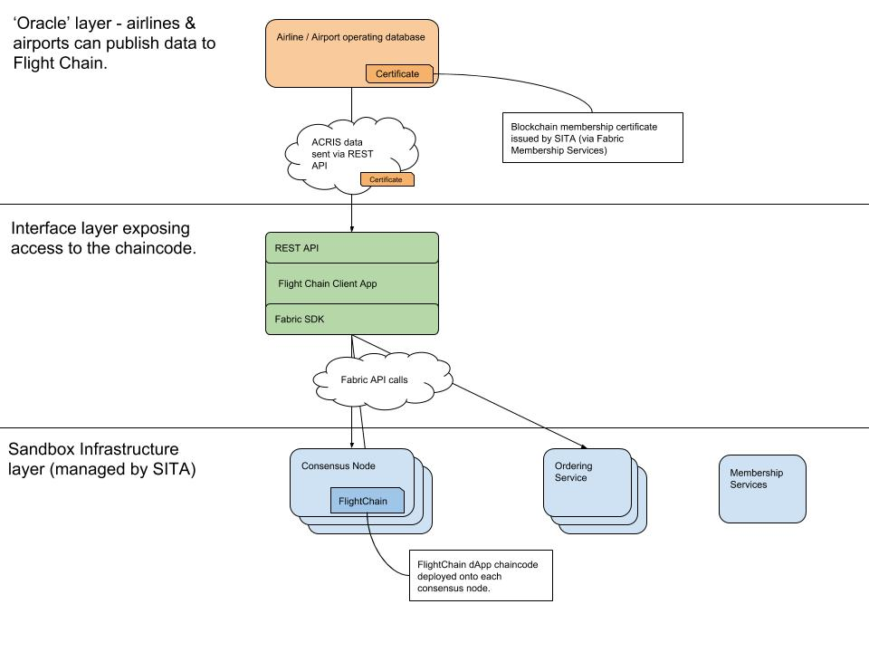

# FlightChain

Flight Chain is one of the reference dApp deployments being put onto the SITA Aviation Blockchain Sandbox. It aggregrates flight data from multiple sources and creates a single version of the truth on a private permissioned blockchain. 


### Architecture



This simplified three layer diagram shows:
 
 - The sandbox infrastructure at the bottom. This is the Hyperledger Fabric network (consisting of consensus nodes, 
ordering services and membership services). This is the network manged by SITA. The smart contracts (chain code) gets
deployed onto this, and this network maintains the ledger world state. In future iterations of the blockchain network, 
the consensus nodes will be spread over different airlines/airport data centres.

 - The Flight Chain Fabric Client app is the middle layer. This layer exposes access to the Flight Chain smart contract
 as a set of REST APIs (to query & publish updates). 
 
- The top layer shows airport/airline operating databases which POST updates during the lifecycle of a flight into 
the REST API.   

To comment on this diagram, see the [source architecture document](https://docs.google.com/drawings/d/1Zq-vAdJJv_G257eTWgB1CtkCOL1dma3JcDOeYaw4O4Q/edit)


### ACI ACRIS
There are many existing data standards for representing flight status data. Flight Chain uses [ACRIS](http://www.aci.aero/About-ACI/Priorities/Airport-IT/ACRIS) 
(a standard defined by [ACI](http://www.aci.aero)). This is a compact & modern data format using JSON with a well defined schema.

### Sample APIs


#### 1. Add new flight

This API call shows an example of POSTing a new flight to the ledger. This will return a unique flight key for this flight (`2017-04-05MIAAA1481`).   

```
curl -X POST 'https://flightchain.blockchainsandbox.aero/' -d "
{
  "operatingAirline": {
    "iataCode": "AA",
    "icaoCode": "AAL",
    "name": "American Airlines"
  },
  "aircraftType": {
    "icaoCode": "B757",
    "modelName": "757",
    "registration": "N606AA"
  },
  "flightNumber": {
    "airlineCode": "AA",
    "trackNumber": "1481"
  },
  "departureAirport": "MIA",
  "arrivalAirport": "SDQ",
  "originDate": "2017-04-05",
  "departure": {
    "scheduled": "2017-04-05T12:27:00-04:00",
    "estimated": "2017-04-05T12:27:00-04:00",
    "terminal": "N",
    "gate": "D47"
  },
  "arrival": {
    "scheduled": "2017-04-05T14:38:00-04:00",
    "terminal": "",
    "gate": "",
    "baggageClaim": {
      "carousel": ""
    }
  },
  "flightStatus": "Scheduled"
}
"
```

#### 2. Update an existing flight

This API call shows an example of POSTing an update to the flight (in this case the estimated departure time is updated). Note the use of the flight key value in 
the 

```
curl -X POST 'https://flightchain.blockchainsandbox.aero/2017-04-05MIAAA1481' -d "
{
  "departure": {
    "estimated": "2017-04-05T12:34:00-04:00",
  }
}
"
```


#### 3. Retrieve status on an existing flight

This API call shows an example of querying the realtime status of a flight.

```
curl -X GET 'https://flightchain.blockchainsandbox.aero/2017-04-05MIAAA1481'
```

#### 4. Retrieve update history for a flight

This API call shows an example of retrieving the history of all updates to a flight.

```
curl -X GET 'https://flightchain.blockchainsandbox.aero/2017-04-05MIAAA1481/history'
```

### Deployment

TBD

### References
SITA Flight Chain - https://www.sita.aero/resources/blog/blockchain-in-air-travel

Aviation Blockchain Sandbox - https://www.developer.aero/Blockchain/Aviation-Blockchain-Sandbox

ACI ACRIS - http://www.aci.aero/About-ACI/Priorities/Airport-IT/ACRIS